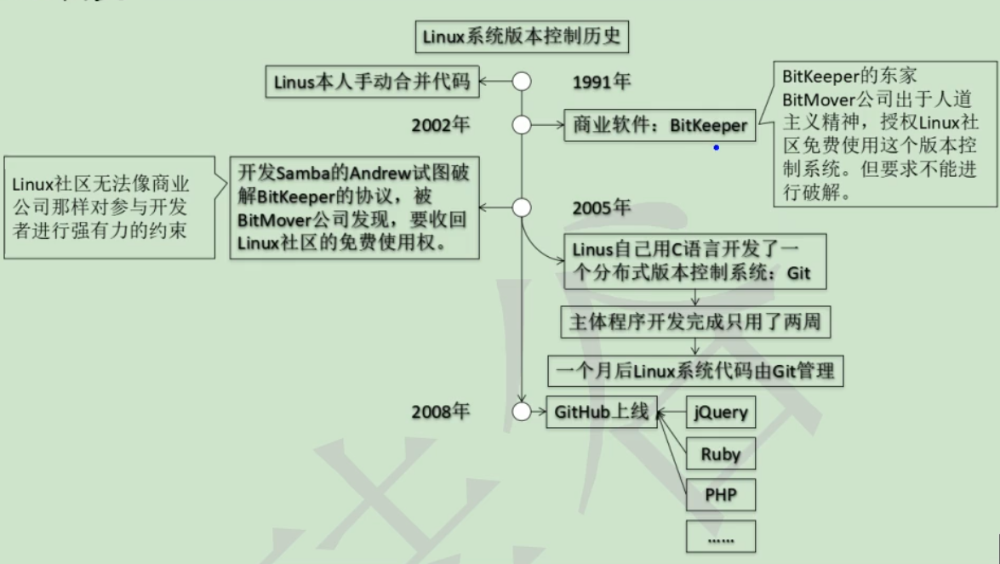
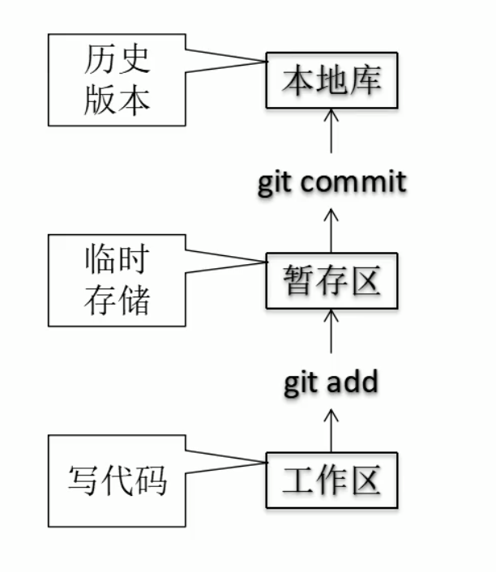
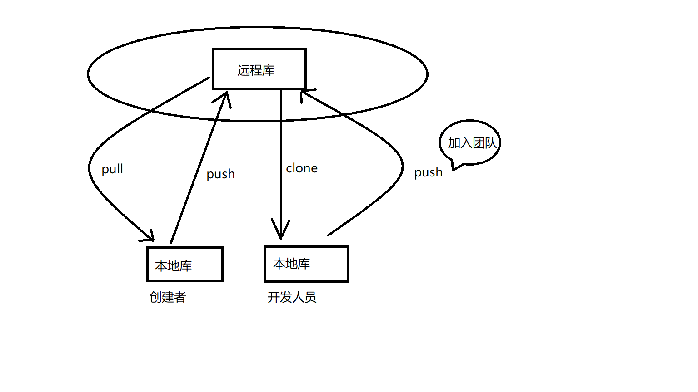
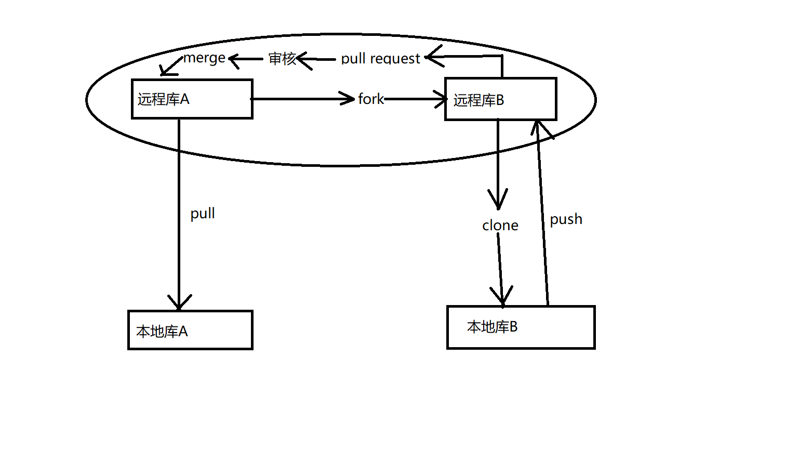

# Git&GitHub

## 1、版本控制工具应该具备的功能

+ 协同修改

  多人并行不悖的修改服务器端的同一个文件。

+ 数据备份

  不仅保存目录和文件的当前状态，还能保存每一个提交过的历史状态。

+ 版本管理

  在保存每一个版本的文件信息的时候要做到不保存重复的数据，以节约存储空间，提高运行效率。这方面SVN采用的是增量式管理的方式，而Git采用文件系统快照的方式。

+ 权限管理

  对团队中参与开发的人员进行权限控制。

  对团队外开发者贡献的代码进行审核——Git独有。

+ 历史记录

  查看修改人、修改时间、修改内容、日志信息。

  将本地文件恢复到某一个历史状态。

+ 分支管理

+ 允许开发团队在工作过程中多条生产线同时推进任务，进一步提高效率。

## 2、版本控制简介

### 2.1、版本控制

工程设计领域中使用版本控制管理工程蓝图的设计过程。在IT开发过程中也可以使用版本控制思想管理代码的版本迭代。

### 2.2、版本控制工具

集中式版本控制工具：CVS、SVN、VSS ...

分布式版本控制工具：Git、Mercurial、Bazaar、Darcs ...

## 3. Git简介

### 3.1、Git简史

### 3.2、Git官网

[官网地址](https://git-scm.com)

### 3.3、Git的优势

+ 大部分操作在本地完成，不需要联网
+ 完整性保证
+ 尽可能添加数据而不是删除或修改数据
+ 分支操作非常快捷流畅
+ 与linux命令全面兼容

### 3.4、Git在本地的结构

Git在本地有工作区、暂存区、本地库。

工作区是平时开发写代码的地方；

暂存区是打算要提交的东西，但还没有提交，暂时先存在这里，将来可以提交到本地库，也可以把它撤回来；

本地库是存储历史版本的地方；

### 3.5、Git和代码托管中心

代码托管中心的任务：维护远程库

+ 局域网环境下
  + GitLab服务器
+ 外网环境下
  + GitHub
  + 码云

### 3.6、本地库和远程库

+ 团队内部协作

  

+ 跨团队协作

  

## 4、Git命令行操作

1. 本地库仓库初始化

   `git add`命令会创建一个.git目录，该目录存放的是本地库相关的子目录和文件。

2. 设置签名

   形式：用户名 + Email地址

   作用：区分不同开发人员的身份

   辨析：这里设置的签名和登录远程仓库（代码托管中心）的账号、密码没有任何的关系。

   命令：

   ​	项目级别/仓库级别：仅在当前本地仓库有效

   ​		git config user.name snl

   ​		git config user.email snl@126.com

   ​		信息保存位置：./.git/config 文件

   ​	系统用户级别：登录当前操作系统的用户范围

   ​		git config --global user.name snl

   ​		git config --global user.email snl@126.com

   ​		信息保存位置：~/.gitconfig 文件

   ​	优先级：

   ​		就近原则：项目级别优先于系统用户级别，二者都有时采用项目级别的签名。

   ​		二者都没有不允许