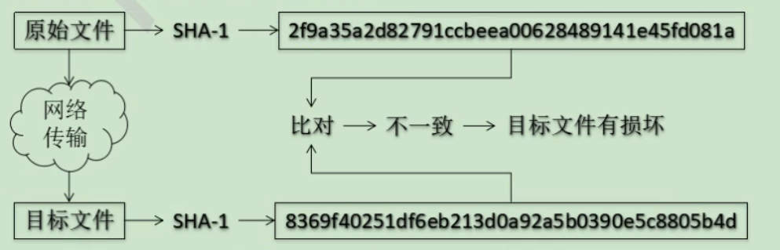

# Git基本原理

## 哈希

哈希是一个系列的加密算法，各个不同的哈希算法虽然加密强度不同，但有以下几个共同点：

1. 不管输入的数据量有多大，输入同一个哈希算法，得到的加密结果长度固定。
2. 哈希算法确定，输入数据确定，输出数据能够保证不变。
3. 哈希算法确定，输入数据有变化，输出数据一定有变化，而且通常变化很大。
4. 哈希算法不可逆

Git 底层采用的是SHA-1算法。这样做的原因是

哈希算法可以被用来验证文件。原理如下图：

## Git保存版本的机制

### 集中式版本控制工具的文件管理机制

以文件变更列表的方式存储信息。这类系统将他们保存的信息看作是一组基本文件和每个文件随时间逐步积累的差异。这种做法能够很好的节约服务器空间。

### Git的文件管理机制

Git把数据看作是小型文件系统的一组快照。每次提交更新是Git都会对当前的全部文件制作一个快照并保存这个快照的索引。为了高效，如果文件没有修改，Git不在重新存储该文件，而是只保留一个链接指向之前存储的文件。所以Git的工作方式可以称之为快照流。

### Git文件管理机制细节

+ Git 的 提交对象

  

+ 提交对象及其父对象形成的链条

  

