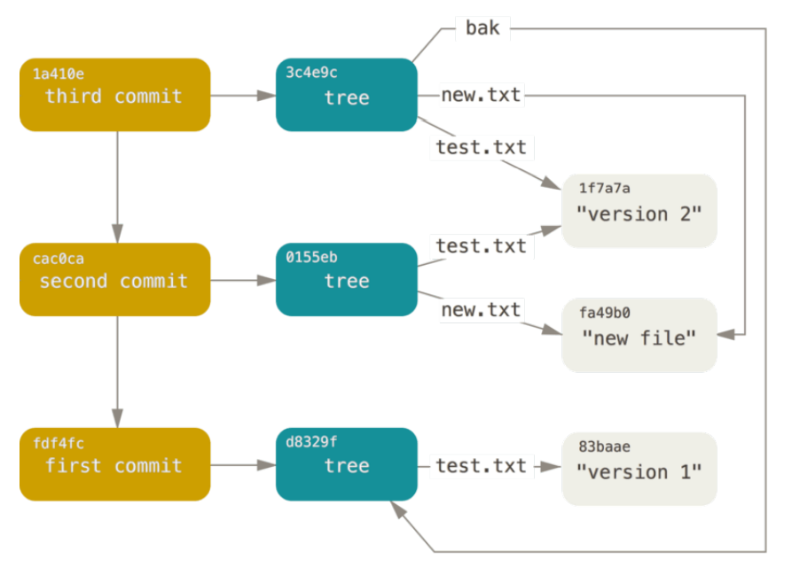

# Git 原理

## Git 对象

> **从根本上来讲，Git是一个内容寻址的文件系统，其次才是一个版本控制系统。**意思是根据文件内容的hash码来定位文件。这就意味着同样内容的文件，在这个文件系统中会指向同一个位置，不会重复存储。

在 Git 中主要存在三种类型对象：数据对象、树对象、提交对象。Git 的文件系统 和 Linux 的设计思路类似，即将文件的内容和文件的属性分开存储，文件内容以“装满字节的袋子”存储在文件系统中，文件名、所有者、权限等文件属性信息则另外开辟区域进行存储。在Git中，数据对象相当于文件内容，树对象相当于文件目录树，提交对象则是对文件系统的快照。

### 数据对象

数据对象存储文件的内容，不包括文件名、权限等信息。Git 根据文件内容通过 SHA-1 哈希算法计算文件的哈希值，以哈希值作为文件的索引存储在 Git 文件系统中。由于相同内容的文件生成的哈希值是一致的，所以相同的文件内容在 Git 中只会存储一次。

使用 `git hash-object`可以计算文件的 hash 值，并将生成的数据对象存入 Git 文件系统中。

```shell
$ echo 'version 1' | git hash-object -w --stdin
83baae61804e65cc73a7201a7252750c76066a30
$ echo 'version 2' | git hash-object -w --stdin
1f7a7a472abf3dd9643fd615f6da379c4acb3e3a
$ echo 'new file' | git hash-object -w --stdin
fa49b077972391ad58037050f2a75f74e3671e92
```

上面示例中，`-w`表示将数据对象写入到Git文件系统中，如果不加这个选项，那么只计算文件的hash值而不写入；`--stdin`表示从标准输入中获取文件内容，当然也可以指定一个文件路径代替此选项。


使用`git cat-file`可以用来实现所有Git对象的读取，包括数据对象、树对象、提交对象的查看：

```shell
$ git cat-file -p 83baae61804e65cc73a7201a7252750c76066a30
version 1
$ git cat-file -t 83baae61804e65cc73a7201a7252750c76066a30
blob
```

上面示例中，`-p`表示查看Git对象的内容，`-t`表示查看Git对象的类型。


数据对象只是解决了文件内容存储的问题，而文件名的存储则需要通过下一节的树对象来解决。

### 树对象

树对象解决文件名保存的问题，也允许我们将多个文件组织到 一起。

 Git 以一种类似于 UNIX 文件系统的方式存储内容，但作了些许简化。

 所有内容均以树对象和数据对象的 形式存储，其中树对象对应了 UNIX 中的目录项，数据对象则大致上对应了 inodes 或文件内容。

一个树对象包含了一条或多条树对象记录（tree entry），每条记录含有一个指向数据对象或者子树对象的 SHA-1 指针，以及相应的模式、类型、文件名信息。

使用`git update-index`可以为数据对象指定名称和模式，然后使用`git write-tree`将树对象写入到Git文件系统中：

```shell
$ git update-index --add --cacheinfo 100644 83baae61804e65cc73a7201a7252750c76066a30 test.txt
$ git write-tree
d8329fc1cc938780ffdd9f94e0d364e0ea74f579
$ git cat-file -p d8329fc1cc938780ffdd9f94e0d364e0ea74f579
100644 blob 83baae61804e65cc73a7201a7252750c76066a30 test.txt
```

`--add`表示新增文件名，如果第一次添加某一文件名，必须使用此选项；

`--cacheinfo   `是要添加的数据对象的模式、hash值和路径，`<path>`意味着为数据对象不仅可以指定单纯的文件名，也可以使用路径。

本例中，我们指定的文件模式为 100644，表明这是一个普通文件。 其他选择包括：100755，表示一个可执行 文件；120000，表示一个符号链接。 这里的文件模式参考了常见的 UNIX 文件模式，但远没那么灵活——上述 三种模式即是 Git 文件（即数据对象）的所有合法模式（当然，还有其他一些模式，但用于目录项和子模块）。

另外要注意的是，使用`git update-index`添加完文件后，一定要使用`git write-tree`写入到Git文件系统中，否则只会存在于index区域（暂存区）。


接下来我们来创建一个新的树对象，它包括 test.txt 文件的第二个版本，以及一个新的文件：

```shell
$ echo 'new file' > new.txt
$ git update-index --cacheinfo 100644 1f7a7a472abf3dd9643fd615f6da379c4acb3e3a test.txt
$ git update-index --add --cacheinfo 100644 fa49b077972391ad58037050f2a75f74e3671e92 new.txt
$ git write-tree
```

可以通过对 read-tree 指定 --prefix 选项，将一个已有的树对象作为子树读入暂存区。

```shell
$ git read-tree --prefix=bak d8329fc1cc938780ffdd9f94e0d364e0ea74f579
$ git write-tree
3c4e9cd789d88d8d89c1073707c3585e41b0e614
$ git cat-file -p 3c4e9cd789d88d8d89c1073707c3585e41b0e614
040000 tree d8329fc1cc938780ffdd9f94e0d364e0ea74f579 bak
100644 blob fa49b077972391ad58037050f2a75f74e3671e92 new.txt
100644 blob 1f7a7a472abf3dd9643fd615f6da379c4acb3e3a test.txt
```

现在我们创建了三个树对象，他们的存储形式应该如下图所示。

### 提交对象

现在我们有了三个树对象，分别表示我们想要追踪的不同项目快照。但是有一个问题是：如果想使用这些快照，就必须记住这些快照的 SHA-1 哈希值。而且你完全不知道是谁保存了这些快照，在什么时候保存的，以及为什么保存这些快照。而以上这些，正是提交对象（commit object）能为你保存的基本信息。

调用 `commit-tree` 命令创建一个提交对象，需要指定一个树对象的 SHA-1 值，以及该提交的父提交对象（如果存在）。我们先创建第一个树对象。

```shell
$ echo 'first commit' | git commit-tree d8329f
f9f55034d970bc900f33765206faae2da125acca
```

需要注意的是：生成的提交对象的 SHA-1 值会根据用户和时间的不同而不同。

通过 `cat-file` 查看生成的提交对象。

提交对象的格式很简单：先指定一个顶层树对象，表示当前项目快照；然后是作者/提交者信息（user.name 和 user.email，外加一个时间戳）；留空一行，最后是提交注释。

```shell
$ git cat-file -p f9f550
tree d8329fc1cc938780ffdd9f94e0d364e0ea74f579
author AimerFan <1261105760@qq.com> 1609898585 +0800
committer AimerFan <1261105760@qq.com> 1609898585 +0800

first commit
```

下面创建另外两个对象，分别引用各自的上一个提交。

```shell
$ echo 'second commit' | git commit-tree 0155eb -p fdf4fc3
d1e52c3cfbdc5496bf86b4d3911ad860937b31d7
$ echo 'third commit' | git commit-tree 3c4e9c -p d1e52c
a7ce5a815e78abcc58f86f15a1ec955d8edb92cb
```

这三个提交对象分别指向之前创建的三个树对象快照中的一个。 现在，如果对最后一个提交的 SHA-1 值运行 git log 命令，会出乎意料的发现，你已有一个货真价实的、可由 git log 查看的 Git 提交历史了：

```shell
$ git log --stat a7ce5a
commit a7ce5a815e78abcc58f86f15a1ec955d8edb92cb
Author: AimerFan <1261105760@qq.com>
Date:   Wed Jan 6 10:07:06 2021 +0800

    third commit

 bak/test.txt | 1 +
 1 file changed, 1 insertion(+)

commit d1e52c3cfbdc5496bf86b4d3911ad860937b31d7
Author: AimerFan <1261105760@qq.com>
Date:   Wed Jan 6 10:05:39 2021 +0800

    second commit

 new.txt  | 1 +
 test.txt | 2 +-
 2 files changed, 2 insertions(+), 1 deletion(-)

commit f9f55034d970bc900f33765206faae2da125acca
Author: AimerFan <1261105760@qq.com>
Date:   Wed Jan 6 10:03:05 2021 +0800

    first commit

 test.txt | 1 +
 1 file changed, 1 insertion(+)
```

如果跟踪所有的内部指针，将得到一个类似下面的对象关系图：



### Git 对象的存储

Git 以对象的类型作为开头来构造一个头部信息，接着 Git 会添加一个空格，随后之后是数据内容的长度，最后是一个空字节（null byte）。

Git 会将上述的头部信息和原始数据拼接起来，并计算出这条新内容的 SHA-1 校验和。并且使用 zlib 库压缩拼接的数据并存入磁盘。生成的 SHA-1 的前两位为文件夹名，后18位为文件名。

## Git 引用

我们可以借助类似于 git log 1a410e 这样的命令来浏览完整的提交历史，但为了能遍历那段历史从而找到所 有相关对象，你仍须记住 1a410e 是最后一个提交。 我们需要一个文件来保存 SHA-1 值，并给文件起一个简单的名字，然后用这个名字指针来替代原始的 SHA-1 值。

在 Git 里，这样的文件被称为“引用（references，或缩写为 refs）”；你可以在 .git/refs 目录下找到这类含有 SHA-1 值的文件。

使用 `update-ref`来创建更新需要的引用

```shell
$ git update-ref refs/heads/master a7ce5a815e78abcc58f86f15a1ec955d8edb92cb
$ git update-ref refs/heads/test d1e52c3cfbdc5496bf86b4d3911ad860937b31d7
```

这样我们就创建了两个分支，可以使用`git checkout`指令来切换不同的分支。

### HEAD引用

HEAD 文件是一个符号引用（symbolic reference），存储着最新提交的 SHA-1 值，指向目前所在的分支。 所谓符号引用，意味着它并不像普通引用那样包含一个 SHA-1 值——它是一个指向其他引用的指针。 如果查看 HEAD 文件的内容，一般而言我们看到的类似这样：

```shell
$ cat .git/HEAD
ref: refs/heads/master
```

你可以手动编辑该文件，然而同样存在一个更安全的命令来完成此事：`symbolic-ref`。 可以借助此命令来查看 HEAD 引用对应的值：

```shell
$ git symbolic-ref HEAD refs/heads/test
$ cat .git/HEAD
ref: refs/heads/test
```

### 标签引用

前文我们刚讨论过 Git 的三种主要对象类型，事实上还有第四种。 标签对象（tag object）非常类似于一个提交对象——它包含一个标签创建者信息、一个日期、一段注释信息，以及一个指针。

主要的区别在于，标签对象通常指向一个提交对象，而不是一个树对象。 它像是一个永不移动的分支引用——永远指向同一个提交对象，只不过给这个提交对象加上一个更友好的名字罢了。

存在两种类型的标签：附注标签和轻量标签。

可以像这样创建一个轻量标签：

```shell
$ git tag -a v1.1 d1e52c3cfbdc5496bf86b4d3911ad860937b31d7 -m 'test tag'
```

这就是轻量标签的全部内容——一个固定的引用。

附注标签则更复杂一些。 若要创建一个附注标 签，Git 会创建一个标签对象，并记录一个引用来指向该标签对象，而不是直接指向提交对象。 可以通过创建一 个附注标签来验证这个过程（-a 选项指定了要创建的是一个附注标签）：

```shell
$ git tag -a v1.1 a7ce5a815e78abcc58f86f15a1ec955d8edb92cb -m 'test tag'
$ cat .git/refs/tags/v1.1
9585191f37f7b0fb9444f35a9bf50de191beadc2
```

现在对该 SHA-1 值运行 cat-file 命令：

```shell
$ git cat-file -p 9585191f37f7b0fb9444f35a9bf50de191beadc2
object 1a410efbd13591db07496601ebc7a059dd55cfe9
type commit
tag v1.1
tagger Scott Chacon <schacon@gmail.com> Sat May 23 16:48:58 2009 -0700
test tag
```

我们注意到，object 条目指向我们打了标签的那个提交对象的 SHA-1 值。 

另外要注意的是，标签对象并非必须 指向某个提交对象；你可以对任意类型的 Git 对象打标签。 例如，在 Git 源码中，项目维护者将他们的 GPG 公 钥添加为一个数据对象，然后对这个对象打了一个标签。

### 远程引用

我们将看到的第三种引用类型是远程引用（remote reference）。如果你添加了一个远程版本库并对其执行过推送操作，Git 会记录下最近一次推送操作时每一个分支所对应的值，并保存在 refs/remotes 目录下。

此时，如果查看 refs/remotes/origin/master 文件，可以发现 origin 远程版本库的 master 分支所对应的 SHA-1 值，就是最近一次与服务器通信时本地 master 分支所对应的 SHA-1 值。

**远程引用和分支（位于 refs/heads 目录下的引用）之间最主要的区别在于，远程引用是只读的。 **虽然可以 git checkout 到某个远程引用，但是 Git 并不会将 HEAD 引用指向该远程引用。因此，你永远不能通过 commit 命令来更新远程引用。 Git 将这些远程引用作为记录远程服务器上各分支最后已知位置状态的书签来管理。

## 包文件

在最初存储对象的过程中，Git 使用 zlib 压缩这些文件的内容。

Git 最初向磁盘中存储对象时所使用的格式被称为“松散（loose）”对象格式。 但是，Git 会时不时地将多个这些对象打包成一个称为“包文件（packfile）“的二进制文件，以节省空间和提高 效率。 当版本库中有太多的松散对象，或者你手动执行 `git gc` 命令，或者你向远程服务器执行推送时，Git 都会这样做。 要看到打包过程，你可以手动执行 `git gc` 命令让 Git 对对象进行打包：

```shell
$ git gc
Counting objects: 18, done.
Delta compression using up to 8 threads.
Compressing objects: 100% (14/14), done.
Writing objects: 100% (18/18), done.
Total 18 (delta 3), reused 0 (delta 0)
```

这个时候再查看 objects 目录，你会发现大部分的对象都不见了，与此同时出现了一对新文件：

```shell
$ find .git/objects -type f
.git/objects/bd/9dbf5aae1a3862dd1526723246b20206e5fc37
.git/objects/d6/70460b4b4aece5915caf5c68d12f560a9fe3e4
.git/objects/info/packs
.git/objects/pack/pack-978e03944f5c581011e6998cd0e9e30000905586.idx
.git/objects/pack/pack-978e03944f5c581011e6998cd0e9e30000905586.pack
```

仍保留着的几个对象是未被任何提交记录引用的数据对象。因为你从没将它们添加至任何提交记录中，所以 Git 认为它们是悬空 （dangling）的，不会将它们打包进新生成的包文件中。

包文件包含了刚才从文件系统中移除的所有对象的内容。 索引文件包含了包文件的偏移信息，我们通过索引文件就可以快速定位任意一个指定对象。