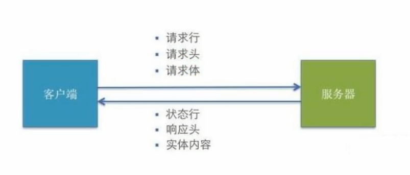

# axios从入门到源码

## 1. HTTP相关

### 1.1 HTTP请求交互的基本过程

1. 前后应用从浏览器端向服务器发送HTTP请求（请求报文）
2. 后台服务器接收到请求后，调度服务器应用处理请求，向浏览器端返回HTTP响应（响应报文）
3. 浏览器端接收到响应，解析显示响应体/调用监视回调

### 1.2 HTTP请求报文

1. 请求行
2. 多个请求头
3. 请求体

### 1.3 HTTP响应报文

1. 响应状态行
2. 多个响应头
3. 响应体

### 1.4 post请求体参数格式

1. ContentType: application/x-www-form-urlencoded;charset=utf-8

   用于键值对参数，参数的键值对用=链接，参数之间用&链接

2. Content-Type: application/json;charset=utf-8

   用于json字符串参数

   例如：{"name": "123456", "age": 18}

3. Content-Type: multipart/form-data

   用于文件上传 

### 1.5 常见的响应状态码

状态码 | 含义 | 描述
-|-|-
200 | OK | 请求成功。一般用于GET和POST请求 |
201 | Created | 已创建。成功请求创建了新的资源 |
401 | Unauthorized | 未授权/请求要求用户的身份认证 |
404 | Not Found | 服务器无法根据客户端的请求找到资源 |
500 | Internal Server Error | 服务器内部错误，无法完成请求 |

### 1.6 不同类型的请求及其作用

| 类型   | 描述               |
| ------ | ------------------ |
| GET    | 从服务器端读取数据 |
| POST   | 向服务器端添加数据 |
| PUT    | 更新服务器端的数据 |
| DELETE | 删除服务器端的数据 |

### 1.7 API的分类

1. REST API：restful
   1. 发送请求进行CRUD哪个操作由请求方式来决定
   2. 同一个请求路径可以进行多个操作
   3. 请求方式会用到GET/POST/PUT/DETLETE
2. 非REST API：restless
   1. 请求方式不决定请求的CRUD
   2. 一个请求路径值对应一个操作
   3. 一般只有GET/POST

