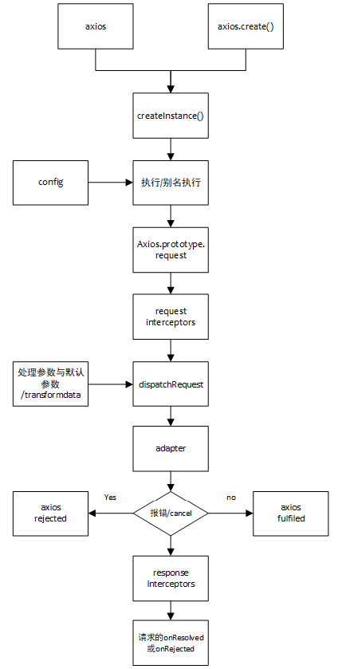

# axios从入门到源码

## 1. HTTP相关

### 1.1 HTTP请求交互的基本过程

1. 前后应用从浏览器端向服务器发送HTTP请求（请求报文）
2. 后台服务器接收到请求后，调度服务器应用处理请求，向浏览器端返回HTTP响应（响应报文）
3. 浏览器端接收到响应，解析显示响应体/调用监视回调

### 1.2 HTTP请求报文

1. 请求行
2. 多个请求头
3. 请求体

### 1.3 HTTP响应报文

1. 响应状态行
2. 多个响应头
3. 响应体

### 1.4 post请求体参数格式

1. ContentType: application/x-www-form-urlencoded;charset=utf-8

   用于键值对参数，参数的键值对用=链接，参数之间用&链接

2. Content-Type: application/json;charset=utf-8

   用于json字符串参数

   例如：{"name": "123456", "age": 18}

3. Content-Type: multipart/form-data

   用于文件上传 

### 1.5 常见的响应状态码

状态码 | 含义 | 描述
-|-|-
200 | OK | 请求成功。一般用于GET和POST请求 |
201 | Created | 已创建。成功请求创建了新的资源 |
401 | Unauthorized | 未授权/请求要求用户的身份认证 |
404 | Not Found | 服务器无法根据客户端的请求找到资源 |
500 | Internal Server Error | 服务器内部错误，无法完成请求 |

### 1.6 不同类型的请求及其作用

| 类型   | 描述               |
| ------ | ------------------ |
| GET    | 从服务器端读取数据 |
| POST   | 向服务器端添加数据 |
| PUT    | 更新服务器端的数据 |
| DELETE | 删除服务器端的数据 |

### 1.7 API的分类

1. REST API：restful
   1. 发送请求进行CRUD哪个操作由请求方式来决定
   2. 同一个请求路径可以进行多个操作
   3. 请求方式会用到GET/POST/PUT/DETLETE
2. 非REST API：restless
   1. 请求方式不决定请求的CRUD
   2. 一个请求路径值对应一个操作
   3. 一般只有GET/POST

### 1.8 使用 json-server 搭建REST API

https://github.com/typicode/json-server

## 2. XHR的理解和使用

https://developer.mozilla.org/zh-CN/docs/Web/API/XMLHttpRequest

1. 区别一般http请求与ajax请求

   1. ajax请求是一种特别的http请求
   2. 对服务器端来说，没有任何区别，区别在于浏览器端
   3. 浏览器端发送请求：只有XHR或fetch发出的才是ajax请求，其它所有的都是非ajax请求
   4. 浏览器端接收到响应
      1. 一般请求：浏览器一般会直接显示响应体数据，也就是我们常说的刷新/跳转页面
      2. ajax请求：浏览器不会对界面进行任何更新操作，只是调用监视的回调函数并传入响应相关数据

2. API

   1. XMLHttpRequest()：创建XHR对象的构造函数

   2. status：响应状态码值，比如200，404

   3. statusText：响应状态文本

   4. readyState：标记请求状态的制度属性

      0：初始

      1：open()之后

      2：send()之后

      3：请求中

   5. onreadystatechange：绑定readyState改变的监听

   6. responseType：指定响应数据类型，如果是 json，得到响应后自动解析响应体数据

   7. response：响应体数据，类型取决于responseType的指定

   8. timeout：指定请求超时时间，默认为0代表没有限制

   9. ontimeout：绑定超时的监听\

   10. onerror：绑定请求网络错误的监听

   11. open()：初始化一个请求，参数为:(method. url[, async])

   12. send(data)：发送请求

   13. abort()：终端请求

   14. getResponseHeader(name)：获取指定名称的响应头值

   15. getAllResponseHeaders()：获取所有响应头组成的字符串

   16. setRequestHeader(name, value)：设置请求头

## 3. axios的理解和使用

1. axios是什么？
   1. 前端最流行的ajax请求库
   2. react/vue官方都推荐使用axios

2. axios特点

   1. 基于promise的异步编程ajax请求库
   2. 浏览器端/node端都可以使用
   3. 支持请求/响应拦截器
   4. 支持/响应数据转换
   5. 批量发送多个请求

3. axios常用语法

   1. axios(config)：通用/最本质的发任意类型请求的发送
   2. axios(url[, config])：可以只指定url发get请求
   3. axios.request(config)：等同于axios(config)
   4. axios.get(url[, config])：发get请求
   5. axios.delete(url[, config])：发delete请求
   6. axios.post(url[, data, config])：发post请求
   7. axios.put(url[, data, config])：发put请求
   8. axios.defaults.xxx：请求的默认全局配置
   9. axios.interceptor.request.use()：添加请求拦截器
   10. axios.interceptor.response.use()：添加相应拦截器
   11. axois.create([config])：创建一个新的axios（它没有下面的功能）
   12. axios.Cancel()：用于创建取消请求的错误对象
   13. axios.CancelToken()：用于创建取消请求的token对象
   14. axios.isCancel()：是否是一个取消请求的错误
   15. axios.all(promises)：用于批量执行多个异步请求

### 4. axois 源码分析

1. axios和Axios的关系？
   1. 从语法上来说：axios不是Axios的实例
   2. 从功能上来说：axios时Axios的实例
   3. axios时Axios.prototype.request函数的bind返回的函数
   4. axios作为对象有Axios原型对象上的所有方法，有Axios对象上所有的属性
2. instance与axios的区别？
   1. 相同：
      1. 都是一个能发任意请求的函数：request(config)
      2. 都有发特定请求的各种方法：get()/post()/pull()/delete()
      3. 都有默认配置和拦截器的属性：default/interceptor
   2. 不同：
      1. 默认匹配的值很可能不一样
      2. instance没有axios后面添加的一些方法：create()/CancelToken()/all()

3. 流程图

   

4. 整体流程

   1. request(config) ==> dispatchRequest(config) ==> xhrAdapter(config)

   2. request(config)：

      将请求拦截器/dispatchRequest()/响应拦截器 通过promise链串联起来，返回promise

   3. dispatchRequest(config)

      转换请求数据 ==> 调用xhrAdapter()发送请求 ==> 请求返回后转换响应数据，返回promis4

   4. xhrAdapter(config)：

      创建XHR对象，根据config进行相关设置，发送特定请求，并接收响应数据，返回promise

5. axios的请求/响应拦截器工作流程

   
   
   axios利用promise链的特点，准备一个 chain数组 预先存入 dispathRequest, undefined，在请求拦截器中每次取出一个 fulfilled和rejected 函数 放到 chain 首部，在响应拦截器中每次取出一个 fulfilled和rejected 函数放到chain 尾部，所以导致请求拦截器后申明的先被调用。
   
   chain: [dispatchRequest, undefined]
   interceptors.request：[{fulfilled1, rejected1}, {fulfilled2, rejected2}]
   interceptors.response：[{fulfilledA, rejectedA}, {fulfilledB, rejectedB}]
   ===========>
   chain：[
   fulfilled2, rejected2, fulfilled1, rejected1,
   dispatchRequest, undefined,
   fulfilledA, rejectedA, fulfilledB, rejectedB
   ]

6. 如何取消未完成的请求？
   1. 当配置了cancelToken 对象时，保存cancel函数
      1. 创建一个用于将来中断请求的cancelPromise
      2. 并定义了一个用于中断请求的cancel函数
      3. 将cancel函数传递出来
   2. 调用cancel()取消请求
      1. 执行cancel函数，传入错误信息message
      2. 内部会让cancelPromise变为成功，且成功的值为一个Cancel对象
      3. 在cancelPromise的成功回调中中断请求，并让发请求的promise失败，失败的reason为Cancel对象