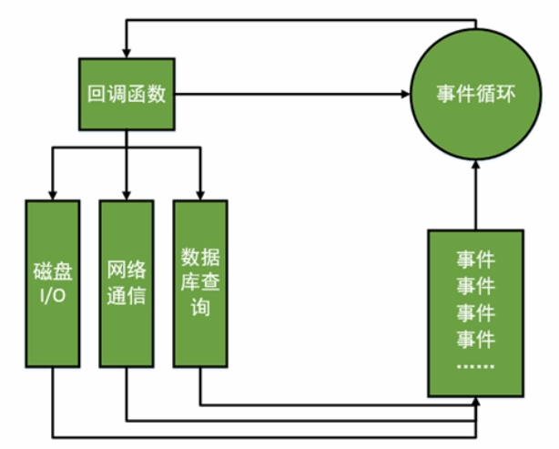

# Node.js

## 1. Node.js 简介

### 1.1 简介

**[Node.js官网](https://nodejs.org)**

V8引擎本身就是用于Chrome浏览器的JS解释部分，但Ryan Dahl 把V8 搬到了服务器上，用于做服务器的软件。

是一个专注于实现高性能Web服务器优化的专家，几经探索，几经挫折后，遇到V8而诞生的项目。

**Node.js 是什么？**

​	Node.js是一个让JavaScript运行在服务器端的开发平台，它让JavaScript的触角伸到了服务器端，可以于PHP，JSP，Python，Ruby平起平坐。

**但Node似乎有点不同：**

+ Node.js不是一种独立的语言，于PHP，JSP，Python，Ruby的”既是语言，也是平台“不同，Node.js的使用JavaScript进行编程，运行在JavaScript引擎上（V8）。

+ 与PHP，JSP等相比（PHP、JSP、.net都需要运行在服务器上，Apache、Naginx、Tomcat、IIS），Node.js 跳过了Apache、Naginx、IIS等Http服务器，他自己不用建设在任何服务器软件之上。Node.js的许多设计理念与经典架构（LAMP = Linux + Apache + MySQL + PHP）有着很大的不同，可以提供强大的伸缩能力。Node.js没有web容器。

  Node.js 自身的哲学，是花最小的硬件成本，追求更高的并发，更高的处理性能。

### 1.2 特点

所谓的特点，就是Node.js是如何解决服务器高性能瓶颈的。（单线程、非阻塞I/O、事件驱动）

**单线程**

​	在Java、PHP或者.net等服务器端语言中，会为每一个客户端创建一个新的线程。而每个线程需要耗费大约2MB内存。也就是说，理论上，一个8GB内存的服务器可以同时链接的最大用户数为4000个左右。要让Web应用程序支持更多的用户，就需要增加服务器的数量，而Web应用程序的硬件成本当然就上升了。

​	Node.js不为每个客户连接创建一个新的线程，而仅仅使用一个线程。当有用户连接了，就触发一个内部事件，通过非阻塞I/O、事件驱动机制，让Node.js程序宏观上也是并行的。使用Node.js，一个8GB内存的服务器，可以同时处理超过4万用户的连接。

​	另外，单线程带来的好处，还有操作系统完全不再有线程的创建、销毁的事件开销。

​	坏处，就是**一个用户造成了线程的崩溃，整个服务都崩溃了。**

​	单线程也能造成宏观上的并发。

**非阻塞I/O(non-blocking I/O)**

​	例如，当再访问数据库取得数据的时候，需要一段时间。再传统的单线程处理机制中，在执行了访问数据库的代码之后，整个程序都将暂停下来，等待数据库返回结果，才能执行后面的代码。**也就是说，I/O阻塞了代码的执行**，极大的降低了程序的执行效率。

​	由于Node.js中采用了非阻塞型I/O机制，因此在执行了访问数据库的代码之后，将立即转而执行其后面的代码，把数据库返回的结果的处理代码放在回调函数中，从而提高了程序的执行效率。

​	当某个I/O执行完毕时，将以事件的形式通知执行IO操作的线程，线程执行这个事件的回调函数。为了处理异步I/O，线程必须有事件循环，不断的检查有没有未处理的事件，依次予以处理。

​	阻塞模式下，一个线程只能处理一项任务，想要提高吞吐量必须通过多线程。**而在非阻塞模式下，一个线程永远在执行计算操作，这个线程的CPU核心的利用率永远是100%**。所以，这是一种特别有哲理的解决方案：与其人多，但是好多人闲着；还不如一个人玩命，往死里干活儿。

**事件驱动(event-driven)**

​	在Node.js中，客户端请求创建连接，提交数据等行为，会触发相应的事件。在Node.js中，在一个时刻，只能执行一个事件回调函数，但是在执行事件回调函数的中途，可以转而处理其他事件（比如，又有新用户连接了），然后返回继续执行原事件的回调函数，这种处理机制，称之为”事件环“机制。

​	Node.js底层是C++（V8也是C++写的）。**底层代码中，近半数都用于事件队列、回调函数队列的构建**。用事件驱动来完成服务器的任务调度，这是鬼才才能想到的。

Node.js中所有的I/O都是异步的，回调函数，套回调函数。

### 1.3 适合开发什么？

Node.js适合用来开发什么样的应用程序？

​	善于I/O，不善于计算。因为Node.js最擅长的是任务调度，如果你的业务偏向于CPU进行计算，实际上也相当于这个计算阻塞了这个单线程。

​	当应用程序需要处理大量并发的IO，且在向客户端发出相应前，应用程序内部并不需要进行非常复杂的处理的时候，Node.js非常适合。Node.js也非常适合于web socket配合，开发长连接的实时交互应用程序。

比如：

+ 用户表单收集
+ 考试系统
+ 聊天室
+ 图文直播
+ 提供JSON的API（为前台的Angular使用）

### 1.4 Node.js 无法挑战PHP、JSP等老牌后台语言

Node不是银弹，就是你工具箱中的一个小工具而已。

## 2.Node.js 安装

Node.js和Java非常像，跨平台的。不管是Linux还是Windows编程是完全一样的（有一些不一样，比如路径的表达）。Linux版本的Node.js环境和Windows环境是不一样的，但编程语言一样。很想Java虚拟机。

## 3. 模块

在Node.js中，以模块为单位划分所有功能，并且提供了一个完整的模块加载机制，这时的我们可以将应用程序划分为各个不同的部分。

狭义的说，每一个JavaScript文件都是一个模块：而多个JavaScript文件之间可以相互require，他们共同实现了一个功能，他们整体对外，又称为一个广义上的模块。

在Node.js中，一个JavaScript文件中定义的变量、函数，都只在这个文件内部有效。当需要从模块外部引用这些变量、函数时，必须使用exports对象进行暴露。使用者用require命令引用这个JS文件。