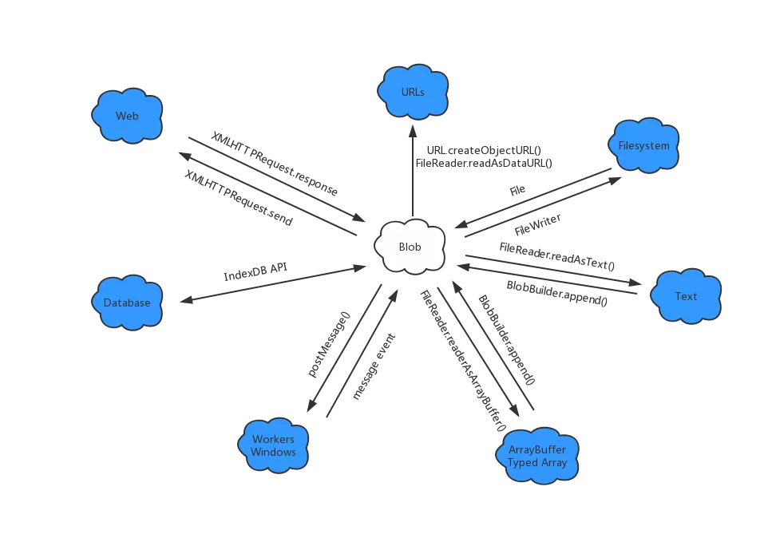

## Blob详解

```Blob``` 是 ```Bindary Large Object```的缩写，意为”大的二进制对象“

《JavaScript权威指南》中对Blob的描述：

> A Blob is an opaque reference to, or handle for, a chunk of data.
>  Blobs oten represent chunks of data from an external source such as a local file, a URL, or a database.

Blob的两个特点：

+ large：Blob表示巨大的数据块，如视频文件
+ opaque（不透明）：我们对Blob可以做到操作仅限于设置字节长度、获取MIME类型、截取更小的Bolb



### 获取Blob的方式

##### 1. Blob支持结构化克隆算法（Structured clone algorithm），所以可以通过消息时间从另外一个窗口或线程中获取Blob对象

##### 2. 从客户端数据库取出Blob

##### 3. 通过http从网络上下载Blob

```javascript
function getBlob(url, callback){
    let xhr = new XMLHTTPRequest();
    xhr.open("GET", url);
    xhr.responseType = "blob";
    xhr.onload = function() {
        callback(xhr.response); // 注意，是 .response 而不是 .responseText 
    }
    // 如果下载的blob很大，可以使用 onprogress 获取下载进度
    xhr.send(null);
}
```

##### 4. 通过```BlobBuilder```创建新的Blob对象

```javascript
var bb = new BlobBuilder();
bb.append('this blob contains this text and 10 big-endian 32-bit signed ints.'); // 写入字符串
bb.append('\0'); // 写入空字符，表示字符串已结束
var arraybuffer = new ArrayBuffer(4*10);
var dataView = new DataView(arrayBuffer);
for(var i=0; i<10; i++){
    dataView.setInt32(i*4, i);
}
bb.append(arrayBuffer); // 写入ArrayBuffer
var blob = bb.getBlob('x-optional/mime-type-here'); // 获取blob，并指定mime类型
```

##### 5. 客户端JS中的```File```对象是Blob的子类型。File是一个有名称（name）和修改日期（lastModifiedDate）属性的Blob数据。可以通过 ```<input type="file">```元素标签或者推拽接口获取File对象

```javascript
<input type="file" id="ele">

const selectedFiles = document.getElementById("ele").files
// files属性是的值是一个File对象数组，包含用户选择的0个或多个文件的file对象。
for (let i = 0; i < selectedFiles.length; i++) {
    const f = selectedFiles[i]
    console.log(f.name, f.lastModifiedDate)
    console.log(f.size, f.type) // Blob对象的属性
}
```

### 对Blob对象可做如下操作：

##### 1. 创建Blob URL

Blob URL 是指向存储再浏览器缓存或磁盘中的Blob的引用

通过```createObjectURL()```获取指向Blob数据的url```blob://```，并且再Dom、css中使用Blob url，用法和普通的url一样

Blob URL 受同源策略限制，只有在同源的document中才是合法的

Blob URL 不是不变的，创建Blob URL的document被用户关闭后，Blob URL 就会变成无效的

```blob://URL```工作方式和```http://URL```类似，当请求```blob://URL```时浏览器行为和http请求相同。如果请求的blob url不在合法，浏览器必须返回404（Not Found）状态码。当请求不同源的blob url时，浏览器必须返回403（Not Allowed）。Blob URL值允许通过```GET```请求，请求成功需要返回状态码200，并且```response.header.Content-Type = Blob.type```

下面的代码时通过Blob URL预览拖拽到指定区域的图片文件。

```html
<!DOCTYPE html>
<html>
    <head>
        <script>
            // 处理浏览器兼容问题
            var getBlobURL = (window.URL && URL.createObjectURL.bind(URL)) ||
                (window.webkitURL && webkitURL.createObjectURL.bind(URL)) ||
                window.createObjectURL;
            // 释放之前通过createObjectURL创建的对象
            var revokeBlobURL = (window.URL && URL.revokeObjectURL.bind(URL)) ||
                (window.webkitURL && webkitURL.revokeObjectURL.bind(URL)) ||
                window.revokeObjectURL;
            
            window.onload = function(){
                var droptarget = document.getElementById('droptarget');
                droptarget.ondragenter = function (e) {
                    var types = e.dataTransfer.types;
                    if (!types ||
                        (types.contains && types.contains('Files')) ||
                        (types.indexOf && types.indexOf('Files') !== -1)
                    ){
                        droptarget.classList.add('active');
                        return false;
                    }
                };
                
                droptarget.ondragleave = function () {
                    droptarget.classList.remove('active');
                };
                
                droptarget.ondragover = function(e) {
                    return false;
                };
                
                droptarget.ondrop = function(e) {
                    var files = e.dataTransfer.files;
                    for(var i=0; i<files.length; i++){
                        var type = files[i].type;
                        if (type.substring(0, 6) !== 'image/') {
                            continue;
                        }
                        var img = document.createElement('img');
                        img.src = getBlobURL(files[i]);
                        img.onload = function () {
                            this.width = 100;
                            document.body.append(this);
                            revokeBlobURL(this.src); // 防止内存泄漏
                        }
                    }
                    droptarget.classList.remove('active');
                    return false;
                }
            }
        </script>
        <style>
            #droptarget {border: solid black 2px; width: 200px; height: 200px;}
            #droptarget.active {border: solid red 4px;}
        </style>
    </head>
    <body>
    <div id="droptarget">Drop Files Here</div>
    </body>
</html>
```

##### 2. 通过```postMessage()```在窗口和工作进程间传输Blob数据

##### 3. 通过Blob存储在客户端数据库

##### 4. 通过XMLHttpRequest的```send()```方法将Blob上传到服务器

##### 5. ```FileReader```对象的异步接口以```string```或```ArrayBuffer```的形式提取Blob对象的内容

因为Blob的体积比较大，所有访问磁盘上的blob的相关API都是异步的

```js
function readfile(f){
    var reader = new FileReader();
    reader.readAsText(f);
    reader.onload = function () {
        var text = reader.result;
        console.log('file content: ', text);
    }
    reader.onerror = function(e){
        console.log('Error', e);
    }
}
```

##### 6. 通过```FileSystem API```和```FileWriter```对象写到本地文件，相关接口浏览器暂不支持

