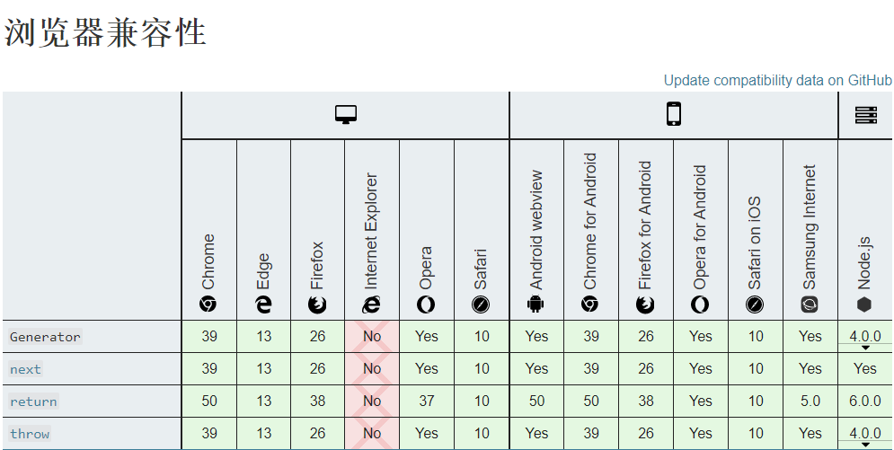

# [Generator](https://developer.mozilla.org/zh-CN/docs/Web/JavaScript/Reference/Global_Objects/Generator)（生成器）

## 什么是Generator？

> 生成器对象是由一个 generator function 返回的,并且它符合可迭代协议和迭代器协议。

`generator` 是ES6标准中提出的概念和语法。

Generator 生成器返回一个 generator 实例，该实例有两种状态：

+ suspended（暂停）：在该状态下，generator实例能够调用next()方法获取下一个yield或者return方法的返回值，在该状态下可以调用throw方法传递异常给Generator进行统一的处理。
+ closed（关闭）：在该状态下，表示generator已经迭代完成，但还是可以使用return方法获得需要的返回值。

调用return，throw方法或者在generator内部执行了return方法都会使generator实例的状态从suspended变成closed。

## 定义一个Generator

在`function`后添加`*`标记该函数是一个Generator函数。

**注意：该函数不能为匿名函数**

调用Generator函数会返回一个Generator实例。且每个生成的Generator实例都互不影响。

`yield`关键字表示该Generator实例执行到这一行会暂停。

`return`表示该Generator实例执行结束并返回 return 后表达式对应的值。即使return后还存在yield，该yield也不会执行。

```js
function* fun(x) {
    yield x + 1
    yield x + 2
    return x + 3
}
let generate = fun(1)
typeof generate		// => function
generate.__prop__	// => Generator {}
```

## Generator中的方法

### 1. next()

> Generator.prototype.next() 返回一个由 yield 表达式生成的值。

返回值由两部分组成

+ value：yield 或者 return 后表达式返回的值，当已经迭代完成则返回 undefined。
+ done：表示改函数是否已经迭代完成。

注意：该方法只能在generator生成的实例中调用，直接调用next会报错。

```js
fun.next()		// => Uncaught TypeError: fun.next is not a function
```

```js
let generator = fun(1)
generator.next()		// => {value: 2, done: false}
generator.next()		// => {value: 3, done: false}
generator.next()		// => {value: 4, done: true}
generator.next()		// => {value: undefined, done: true}
```

### 2. return()

> return() 方法返回给定的值并结束生成器。

调用该方法会将该generator实例标记为完成状态。使用return方法之后再调用next()方法会返回undefined。

即使该generator实例的状态为完成状态，调用return方法依然能返回对应的数据。

+ 语法：

  ```js
  gen.return(value)
  ```

+ 参数：

  value：需要返回的值

+ 返回的值

  返回该函数参数中给定的值

```js
function* gen() { 
  yield 1
  yield 2
  yield 3
}

var g = gen()

g.next()        // { value: 1, done: false }
g.return("foo") // { value: "foo", done: true }
g.next()        // { value: undefined, done: true }
```

> 如果对已经处于“完成”状态的生成器调用`return(value)`，则生成器将保持在“完成”状态。如果没有提供参数，则返回对象的`value`属性与示例最后的`.next()`方法相同。如果提供了参数，则参数将被设置为返回对象的`value`属性的值。

```js
function* gen() {
  yield 1;
  yield 2;
  yield 3;
}

var g = gen();
g.next(); // { value: 1, done: false }
g.next(); // { value: 2, done: false }
g.next(); // { value: 3, done: false }
g.next(); // { value: undefined, done: true }
g.return(); // { value: undefined, done: true }
g.return(1); // { value: 1, done: true }
```

### 3. throw()

>  Generator.proptype.throw()方法用来向生成器抛出异常，并恢复生成器的执行，返回带有 done 及 value 两个属性的对象。

throw参数中的异常会传递至Generator函数中，在函数中使用try/catch语句能够捕捉到该异常。

throw方法会使generator实例的状态转为closed（关闭）。

throw方法只有在generator实例的状态为suspended（暂停）时调用，才能把参数中的异常传递到Generator函数中。

```js
gen.throw(exception)
```

+ 参数：

  exception：用于抛出的异常。使用Error的实例对调试非常有帮助。

+ 返回值：带有两个属性的对象：
  + done：如果迭代器已经返回了迭代序列的末尾，则值为 true。在这种情况下，可以指定迭代器 value的返回值；如果迭代能够继续生产在序列中的下一个值，则值为 false。 这相当与不指定 done 属性的值。
  + value：迭代器返回的任何 JavaScript 值。当 done 是 true 的时候可以省略。

## 兼容性



## 遍历Generator

+ 使用next()方法遍历Generator

  ```js
  function* gen() {
      yield 1
      yield 2
      yield 3
  }
  let g = gen()
  
  let result = g.next()
  // 通过result的done属性来判断该generator是否遍历完成
  while (!result.done) {
      console.log(result)
      result = g.next()
  }
  /*
  {value: 1, done: false}
  {value: 2, done: false}
  {value: 3, done: false}
  */
  ```

+ 使用 for/of 方法遍历Generator

  ```js
  function* gen() {
      yield 1
      yield 2
      yield 3
  }
  let g = gen()
  
  for (let result of g) {
      console.log(result)
  }
  /*
  1
  2
  3
  */
  ```

  